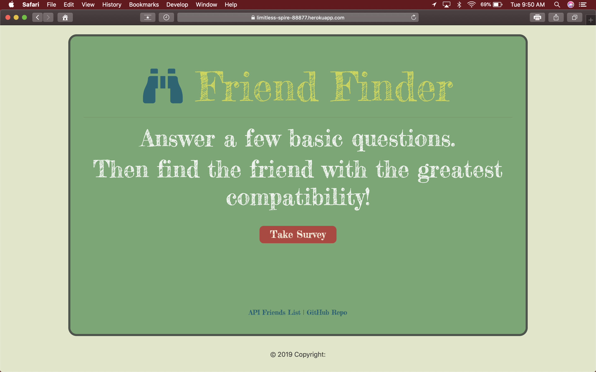
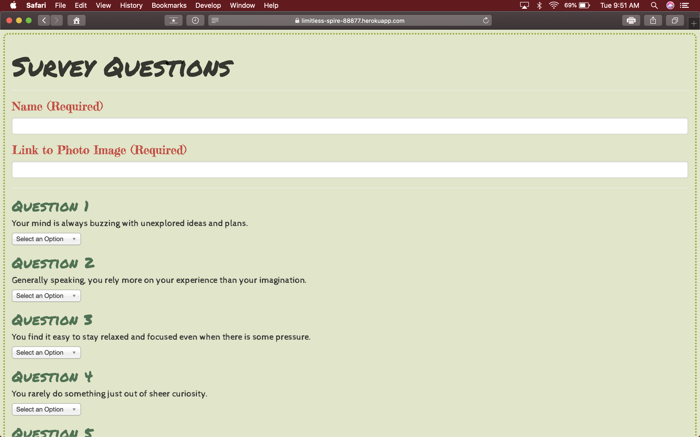

# FriendFinder

## FriendFinder is a full stack app that mimicks a dating application. It is dirven by logic that compares user inputs to API data, linking them to the best match loaded in the database. 

## The application works by steering the user to a survey page if they are interested in finding a compatible friend.  Once the user is at the survey page he/she is asked to return inputs to 10 questions which get loaded into the API on submission. During the submission of the user values, serverside driven logical compares the users inputs to those most similar in match of the data already loaded in the database. Once a match is obtained, the data for the match is displayed for the user via modal with a picture of the match. 

## Technologies Used:

1. HTML
2. CSS
3. Node Js
4. JavaScript
5. Jquery
6. Express
7. Bootstrap

### You can visit site at https://limitless-spire-88877.herokuapp.com/

